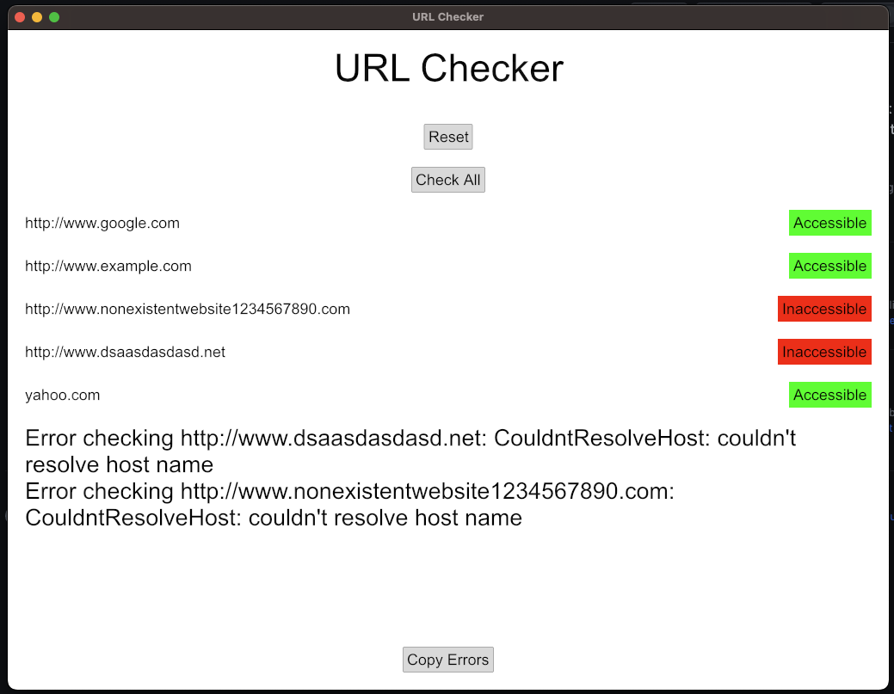

# URL Checker



URL Checker is a simple GUI application written in Rust, using the Iced GUI framework. This tool helps you to check the accessibility of a list of URLs.

## Features

- Check individual URLs for accessibility
- Check all URLs at once
- Indicate which URLs are accessible and which are not
- Provides a log of inaccessible URLs that can be copied to clipboard
- Reset functionality to recheck all URLs 

Please note that this project is a simple utility and is not meant to be a full troubleshooting tool. However, with a bit more work and enhancement, it could be expanded to serve as a more comprehensive solution.

## Getting Started

### Prerequisites

You'll need Rust installed on your machine to run URL Checker. Visit the [official Rust website](https://www.rust-lang.org/tools/install) for installation instructions.

### Running the Project

1. Clone the repository to your local machine:

    ```
    git clone git@github.com:kacesensitive/rust-url-checker.git
    ```

2. Navigate to the project directory:

    ```
    cd rust-url-checker
    ```

3. Compile and run the project:

    ```
    cargo run
    ```

### Troubleshooting

If you encounter a startup error, it might be because the `src/urls.json` file is missing or corrupted. Make sure the file exists and contains a valid JSON array of URL strings.
```
{
    "urls": [
        "http://www.google.com",
        "http://www.example.com",
        "http://www.nonexistentwebsite1234567890.com",
        "http://www.dsaasdasdasd.net",
        "yahoo.com"
    ]
}
```

If you encounter any other issues, please [open an issue on GitHub](https://github.com/kacesensitive/rust-url-checker/issues/new).

## Contributing

We welcome contributions to URL Checker! If you'd like to contribute, please fork the repository and make changes as you'd like. Pull requests are warmly welcome.

## License

This project is open source and available under the [MIT License](LICENSE).
